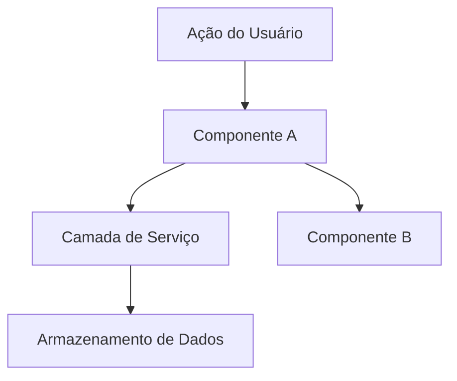

# Design

**Objetivo**: Definir COMO construir. Arquitetura, componentes, o que reutilizar.

**Pule esta fase quando:** A mudança é direta — sem decisões arquiteturais, sem novos padrões, sem interações de componentes para planejar. Para features simples, o design acontece inline durante o Executar.

## Processo

### 1. Carregar Contexto

Leia `.specs/features/[feature]/spec.md` antes de projetar. Se `.specs/features/[feature]/context.md` existir, carregue também — contém decisões de implementação que restringem o design. Decisões marcadas como "Decisão do Agente" são suas para decidir.

### 1.5. Pesquisa (Opcional mas Recomendado)

Se a feature envolve tecnologia, padrões ou integrações desconhecidas, pesquise antes de projetar. Documente descobertas brevemente no doc de design ou como notas inline.

Siga a **Cadeia de Verificação de Conhecimento** (veja SKILL.md) em ordem estrita:

```
Codebase → Docs do projeto → Context7 MCP → Busca web → Sinalizar como incerto
```

**CRÍTICO: NUNCA assuma ou fabrique informação.** Se não conseguir encontrar uma resposta, diga explicitamente "Não sei" ou "Não encontrei documentação para isso". Inventar uma API, padrão ou comportamento que não existe é muito pior do que admitir incerteza.

Bons gatilhos para pesquisa: novas bibliotecas, APIs desconhecidas, features de performance ou segurança sensíveis, padrões não usados neste codebase antes.

### 2. Definir Arquitetura

Visão geral de como os componentes interagem. Use diagramas mermaid quando útil. Antes de criar diagramas, verifique se o skill `mermaid-studio` está disponível.

### 3. Identificar Reuso de Código

**CRÍTICO**: Que código existente pode ser aproveitado? Isso economiza tokens e reduz erros.

Se `.specs/codebase/CONCERNS.md` existir, verifique-o antes de projetar. Qualquer componente sinalizado como frágil, com dívida técnica ou lacunas de cobertura de testes requer cuidado extra no design.

### 4. Definir Componentes e Interfaces

Cada componente: Propósito, Localização, Interfaces, Dependências, O que reutiliza.

### 5. Definir Modelos de Dados

Se a feature envolve dados, defina modelos antes da implementação.

---

## Template: `.specs/[feature]/design.md`

````markdown
# Design: [Feature]

**Spec**: `.specs/[feature]/spec.md`
**Status**: Rascunho | Aprovado

---

## Visão Geral da Arquitetura

[Breve descrição da abordagem arquitetural]



---

## Análise de Reuso de Código

### Componentes Existentes a Aproveitar

| Componente | Localização | Como Usar |
| --- | --- | --- |
| [Componente Existente] | `src/caminho/para/arquivo` | [Estender/Importar/Referenciar] |
| [Utilitário Existente] | `src/utils/arquivo` | [Como ajuda] |
| [Padrão Existente] | `src/patterns/arquivo` | [Aplicar mesmo padrão] |

### Pontos de Integração

| Sistema | Método de Integração |
| --- | --- |
| [API Existente] | [Como a nova feature se conecta] |
| [Banco de Dados] | [Como os dados se conectam ao schema existente] |

---

## Componentes

### [Nome do Componente]

- **Propósito**: [O que este componente faz - uma frase]
- **Localização**: `src/caminho/para/componente/`
- **Interfaces**:
  - `nomeDoMetodo(param: Tipo): TipoRetorno` - [descrição]
  - `nomeDoMetodo(param: Tipo): TipoRetorno` - [descrição]
- **Dependências**: [O que precisa para funcionar]
- **Reutiliza**: [Código existente no qual este se baseia]

---

## Modelos de Dados (se aplicável)

### [Nome do Modelo]

```typescript
interface NomeDoModelo {
  id: string
  campo1: string
  campo2: number
  criadoEm: Date
}
```

**Relacionamentos**: [Como este se relaciona com outros modelos]

---

## Estratégia de Tratamento de Erros

| Cenário de Erro | Tratamento | Impacto para o Usuário |
| --- | --- | --- |
| [Cenário 1] | [Como é tratado] | [O que o usuário vê] |
| [Cenário 2] | [Como é tratado] | [O que o usuário vê] |

---

## Decisões Técnicas (apenas as não-óbvias)

| Decisão | Escolha | Justificativa |
| --- | --- | --- |
| [O que decidimos] | [O que escolhemos] | [Por quê - breve] |
````

---

## Dicas

- **Carregue o contexto primeiro** — Se context.md existir, decisões ali estão bloqueadas
- **Pesquise quando incerto** — 5 minutos de pesquisa evitam horas de retrabalho
- **Reuso é rei** — Todo componente deve referenciar padrões existentes
- **Interfaces primeiro** — Defina contratos antes da implementação
- **Componentes pequenos** — Se o componente faz 3+ coisas, divida-o
- **Verifique CONCERNS.md** — Se existir, sinalize áreas frágeis que o design deve endereçar
- **Confirme antes de Tarefas** — O usuário aprova o design antes de quebrar em tarefas
